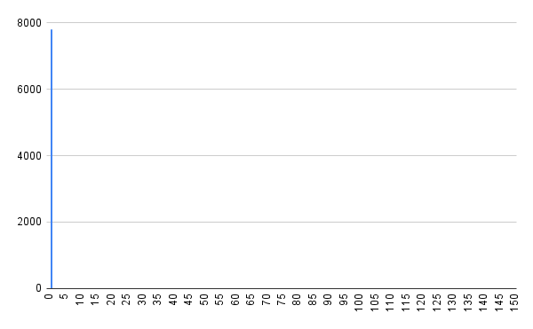
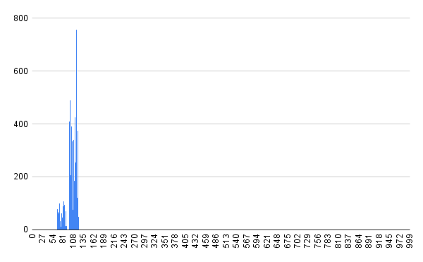
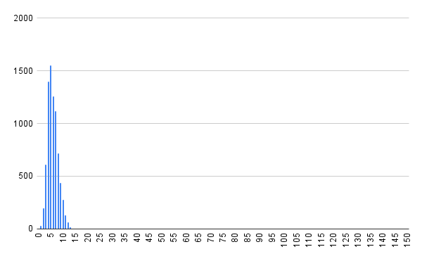
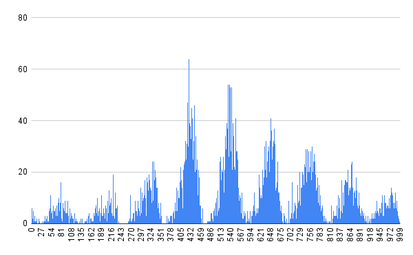
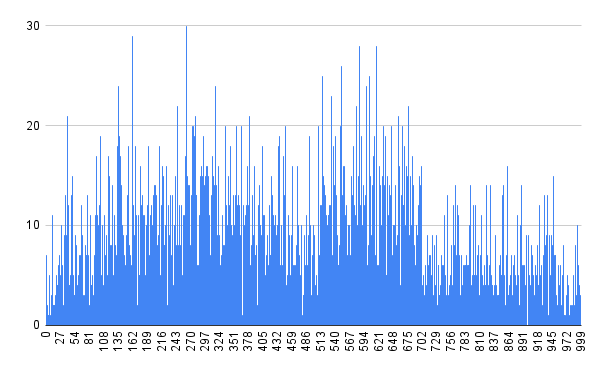
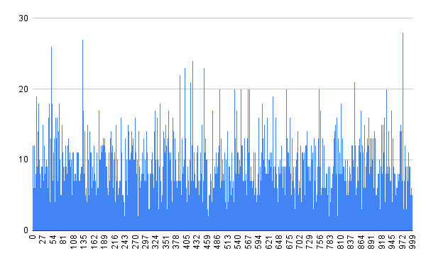
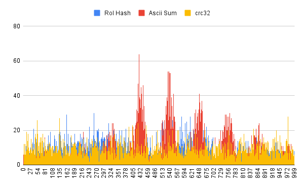
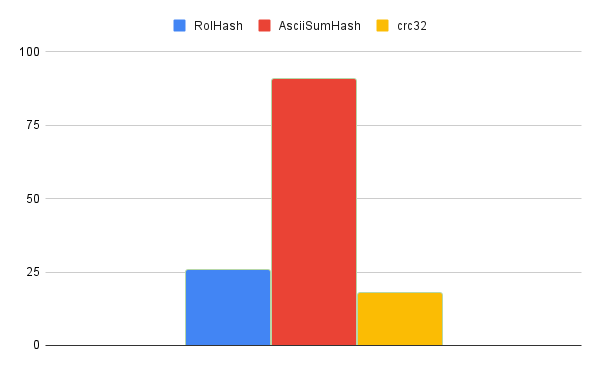
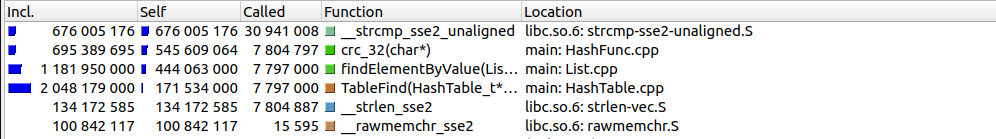
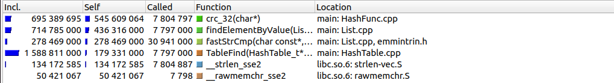

# Вступление
Эта работа посвящена изучению хеш-функций и хеш-таблицы. А именно, будет проверена каждая функция на заселенность и оптимизирована хеш-таблица. Поэтому работа поделена на 2 части.
## Теоретическая справка
### Хеш-функция
### Хеш-таблица
Рассмотрим подробнее принцип работы хеш-таблицы.
Хеш-таблица - это массив списков.
Как видно на рисунке, данные сначала обрабатываются хеш-функцией и по ее значению помещаются в список под номером $hash \% N$, где $N$ число списков в таблице.
# Часть I
В первой части мы изучим все функции на заселенность, а потом выберем самую лучшую для использования в хеш-таблицы и последующей оптимизации. Для тестирования будет использоваться текст В. Шекспира "Гамлет". Количество листов в списке 1000.
## Хеш-функции
### Always1Hash
Очевидно, самая плохая функция, выдающая всегда 1.
```
size_t Always1Hash (Elem_t element)
{
    return 1;
}
```
<details>
<summary>График заселенности хеш-фунции</summary>
Обращаю внимание, что по оси Х кол-во списков всего 150, остальные были выкинуты, потому что значений там нет.



Дисперсия: 60793
</details>

### FirstAsciiHash
Функция возвращающая ASCII номер первого символа слова.
```
size_t firstAsciiHash (Elem_t element)
{
    return element[0];
}
```
<details>
<summary>График заселенности хеш-фунции</summary>
Все списки, кроме 150 были отброшены. Там нет значений



Дисперсия: 2517
</details>

### StrlenHash
Функция возвращающая длину слова в качестве хеша.
```
size_t strlenHash (Elem_t element)
{
    return strlen(element);
}
```
<details>
<summary>График заселенности хеш-фунции</summary>
Все списки, кроме 150 были отброшены. Там нет значений



Дисперсия: 8340
</details>

### AsciiSumHash
Функция возвращают сумму ASCII номеров всем символов слова.
```
size_t asciiSumHash (Elem_t element)
{
    size_t sum = 0;

    for (size_t index = 0; element[index] != '\0'; ++index)
    {
	sum += (unsigned long) element[index];
    }
    return sum;
}
```
<details>
<summary>График заселенности хеш-фунции</summary>



Дисперсия: 90
</details>

### RolHash
Циклический сдвиг хеша влево и ```XOR``` со ASCII номером символа слова.
```
size_t rolHash (Elem_t element)
{
    unsigned int mask  = 0;
    unsigned int index = 0;

    while (element[index])
    {
	mask = myRol(mask, 1) ^ (unsigned int) element[index];
	index += 1;
    }
    return mask;
}
```
Функция ```myRol``` реализация циклического сдвига в C.
<details>
<summary>График заселенности хеш-фунции</summary>



Дисперсия: 26
</details>

### Crc32
crc32 имеет следующую реализацию:
```
size_t crc_32 (Elem_t element)
{
    const uint32_t crc_32_magic_const = 0xFFFFFFFFU;

    const uint8_t *udata = (uint8_t *)element;

    uint32_t crc_32 = crc_32_magic_const;

	for (size_t i = 0; i < 16; i++)
    {
        uint32_t lookup_i = (uint8_t)crc_32 ^ udata[i];
        crc_32 = (crc_32 >> 8) ^ crc_lookup_table[lookup_i];
    }

    crc_32 ^= crc_32_magic_const;

    return crc_32;
}
```

<details>
<summary>График заселенности хеш-фунции</summary>




Дисперсия: 18
</details>

## Вывод
Заселенность трех лучших функций:



Дисперсия трех лучший функций:





По итогам всех измерения видим, что лучшая из всех функций это - crc32. Ее мы и выберем для последующей оптимизации хеш-таблицы, огромным плюсом будет, то что у нее есть ассемблерный аналог.

# Часть II
В данной части мы займемся оптимизацией хеш-таблицы. Для того, чтобы выявить места для оптимизации, будут использоваться инструменты ```сalgrind``` для профайлинга и ```kcachegrind``` для представления файлов, генерируемых ```calgrind```. На всех следующих скриншотах представлен список функций, отсортированных по параметру ```self```, который показывает время затраченное на собственное выполнение.
## Оптимизация I

По скриншоту видно, что функцию, которую надо оптимизировать это ```strcmp```. И вообще это очевидно, так как для поиска элемента в хеш-таблице, нужно искать элемент полным перебором в листе. При поиске строки нужно постоянно сравнивать строки.


Для этого я решил воспользоваться SIMD инструкциями. На моем компьютере есть только SSE расширение, которое работает с 128 битовыми регистрами. Поэтому у нас есть $128/8 = 16$ байт для хранения символов. Поэтому ограничим длину входного слова до 16. Теперь формат входных данных: ```16 char + '\0'```. С этим форматом данным мы можем сделать быструю функцию сравнения с использование SIMD.
```
int fastStrCmp(const char* str1, const char* str2)
{
    const int EqualConst = 0xFFFF;
    __m128i Str1 = _mm_loadu_si64 ((void const*) str1);
    __m128i Str2 = _mm_loadu_si64 ((void const*) str2);

    __m128i result = _mm_cmpeq_epi32 (Str1, Str2);

    if (_mm_movemask_epi8 (result) == EqualConst)
        return 0;

    return 1;
}
```

Результаты после этой оптимизации:


| Version                   |  CPU ticks | Time
|---------------------------|------------|-------
| Not optimized             |2 215 470 092  | 2.15
| Optimization 1            | 1 700 000 000 | 1.98


## Оптимизация II

Следующая функция в списке после второй оптимизации - это хеш-функция. Так этa хеш-функция есть в ассемблере, оптимизируем ассемблерной вставкой.
Реализация:
```
size_t crc_32Fast (Elem_t element)
{
    uint32_t hash = 0;

    __asm__(
        "or $0xFFFFFFFFFFFFFFFF, %%rax\n\t"
        "crc32q (%1),     %%rax\n\t"
        "crc32q 0x08(%1), %%rax\n\t"
        "not %%rax\n\t"
        "movl %%eax, %0\n\t"
        :"=r"(hash)
        :"r"(element)
        :"%rax"
    );

    return hash;
}
```

Результаты после этой оптимизации:


| Version                   |  CPU ticks | Time, sec
|---------------------------|------------|-------
| Not optimized             |2 215 470 092 | 2.15
| Optimization 1            | 1 700 000 000 | 1.98
| Optimization 2            |884 031 687 | 1.65

## Оптимизация III
