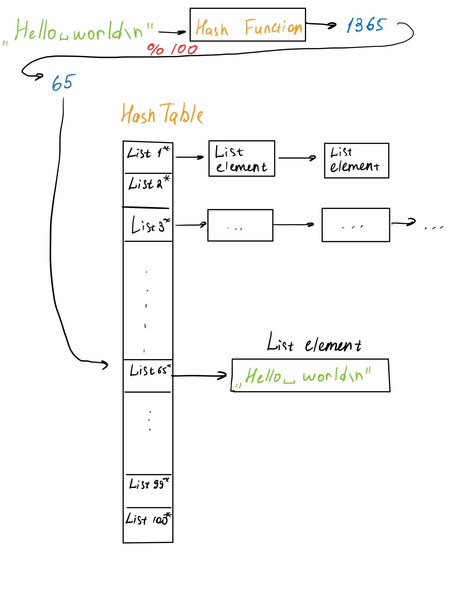
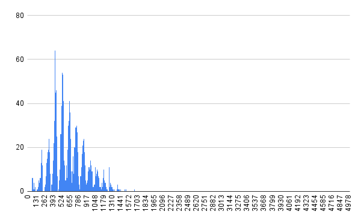
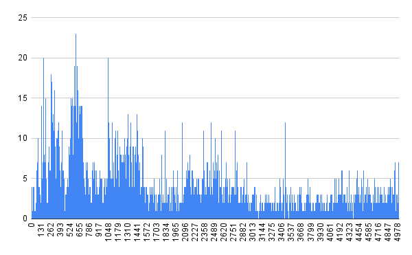
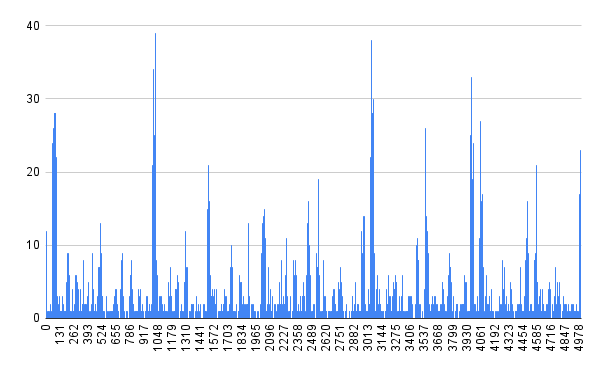
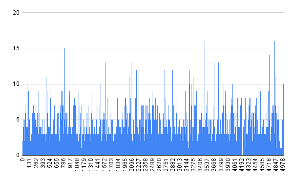
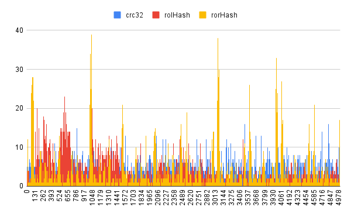
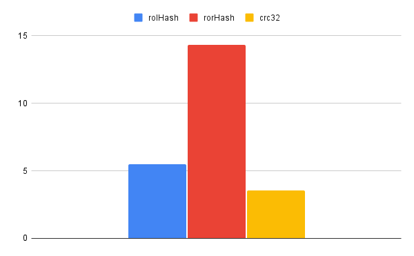

# Вступление
Эта работа посвящена изучению хеш-функций и хеш-таблицы. А именно, будет исследована каждая функция на заселенность и оптимизирована хеш-таблица. Поэтому работа поделена на 2 части.
## Теоретическая справка
### Хеш-функция
**Хеш-функция** - функция, преобразующая массив входных данных в битовую строку фиксированной длины.

**Коллизия** - ситуация, в которой функция выдает одну и ту же битовую строку для двух разных входных массивов.

### Хеш-таблица
Рассмотрим подробнее принцип работы хеш-таблицы.

**Хеш-таблица** - структура данных, позволяющая хранить пары (ключ, значение). Хеш-таблицу используют из-за быстрых вставки, удаления, поиска. Вот сравнение с другими структурами данных:


| Структура данных \ операция | вставка | удаление | поиск |
|-----------------------------|---------|----------|-------|
| Массив                       | O(N)   | O(N)     | O(N) |
| Список                       | O(1)   | O(1)     | O(N) |
| Отсортированный массив       | O(N)   | O(N)     | O(log(N)) |
| Бинарное дерево поиска       | O(log(N)) | O(log(N)) | O(log(N)) |
| Хеш-таблица                  | O(1)   | O(1)     | O(1) |


**Заселенность** - среднее количество элементов в списке.

В данной работе хеш-таблица реализована с помощью списков. Пример работы можно увидеть на картинке.



Как видно на рисунке, данные сначала обрабатываются хеш-функцией и по ее значению помещаются в список под номером ```hash%N```, где $N$ число списков в таблице. При возникновении коллизий, элемент ищется в списке.
# Часть I
В первой части мы изучим все функции на заселенность, а потом выберем самую лучшую для использования в хеш-таблице и последующей оптимизации. Для тестирования будет использоваться текст У. Шекспира "Гамлет". Количество списков в таблице 1000.
## Хеш-функции
### Always1Hash
Очевидно, самая плохая функция, выдающая всегда 1.
```
size_t Always1Hash (Elem_t element)
{
    return 1;
}
```
<details>
<summary>График заселенности хеш-фунции</summary>
Обращаю внимание, что по оси Х кол-во списков всего 150, остальные были выкинуты, потому что значений там нет.


Дисперсия: 60793
</details>

### FirstAsciiHash
Функция, возвращающая ASCII номер первого символа слова.
```
size_t firstAsciiHash (Elem_t element)
{
    return element[0];
}
```
<details>
<summary>График заселенности хеш-фунции</summary>
Все списки, кроме 150 были отброшены. Там нет значений


Дисперсия: 2517
</details>

### StrlenHash
Функция, возвращающая длину слова в качестве хеша.
```
size_t strlenHash (Elem_t element)
{
    return strlen(element);
}
```
<details>
<summary>График заселенности хеш-фунции</summary>
Все списки, кроме 150 были отброшены. Там нет значений


Дисперсия: 8340
</details>

### AsciiSumHash
Функция возвращает сумму ASCII номеров всех символов слова.
```
size_t asciiSumHash (Elem_t element)
{
    size_t sum = 0;

    for (size_t index = 0; element[index] != '\0'; ++index)
    {
	sum += (unsigned long) element[index];
    }
    return sum;
}
```
<details>
<summary>График заселенности хеш-фунции</summary>



Дисперсия: 90
</details>

### RolHash
Циклический сдвиг хеша влево и ```XOR``` со ASCII номером символа слова.
```
size_t rolHash (Elem_t element)
{
    unsigned int mask  = 0;
    unsigned int index = 0;

    while (element[index])
    {
	mask = myRol(mask, 1) ^ (unsigned int) element[index];
	index += 1;
    }
    return mask;
}
```
Функция ```myRol``` реализация циклического сдвига в C.
<details>
<summary>График заселенности хеш-фунции</summary>



Дисперсия: 5
</details>

### RorHash 

Такая же как и ```RolHash``` , только со сдвигом вправо.

```
size_t rorHash (Elem_t element)
{
    size_t mask  = 0;
    size_t index = 0;

    while (element[index])
    {
	mask = myRor(mask) ^ (unsigned long) element[index];
	index += 1;
    }
    return mask;
}
```

<details>
<summary>График заселенности</summary>



</details>

### Crc32

crc32 имеет следующую реализацию:
```
size_t crc_32 (Elem_t element)
{
    const uint32_t crc_32_magic_const = 0xFFFFFFFFU;

    const uint8_t *udata = (uint8_t *)element;

    uint32_t crc_32 = crc_32_magic_const;

	for (size_t i = 0; i < 16; i++)
    {
        uint32_t lookup_i = (uint8_t)crc_32 ^ udata[i];
        crc_32 = (crc_32 >> 8) ^ crc_lookup_table[lookup_i];
    }

    crc_32 ^= crc_32_magic_const;

    return crc_32;
}
```

<details>
<summary>График заселенности хеш-фунции</summary>




Дисперсия: 4
</details>

## Вывод
Заселенность трех лучших функций:



Дисперсия трех лучший функций:





По итогам всех измерения видим, что лучшая из всех функций это - crc32. Ее мы и выберем для последующей оптимизации хеш-таблицы, огромным плюсом будет, то что у нее есть ассемблерный аналог.

# Часть II
В данной части мы займемся оптимизацией хеш-таблицы. Для того, чтобы выявить места для оптимизации, будут использоваться инструменты ```сalgrind``` для профайлинга и ```kcachegrind``` для представления файлов, генерируемых ```calgrind```. На всех следующих скриншотах представлен список функций, отсортированных по параметру ```self```, который показывает время, затраченное на собственное выполнение.
## Оптимизация I

По скриншоту видно, что функция, которую надо оптимизировать это "strcmp". И вообще, это очевидно, так как для поиска элемента в хеш-таблице, нужно искать элемент полным перебором в листе. При поиске строки нужно постоянно сравнивать строки.


Для этого я решил воспользоваться SIMD инструкциями. На моем компьютере есть только SSE расширение, которое работает с 128 битовыми регистрами. Поэтому у нас есть $128/8 = 16$ байт для хранения символов. Поэтому ограничим длину входного слова до 16. Теперь формат входных данных: ```16 char + '\0'```. С этим форматом данным мы можем сделать быструю функцию сравнения с использованием SIMD.

```
int fastStrCmp(const char* str1, const char* str2)
{
    const int EqualConst = 0xFFFF;
    __m128i Str1 = _mm_loadu_si64 ((void const*) str1);
    __m128i Str2 = _mm_loadu_si64 ((void const*) str2);

    __m128i result = _mm_cmpeq_epi32 (Str1, Str2);

    if (_mm_movemask_epi8 (result) == EqualConst)
        return 0;

    return 1;
}
```

Результаты после этой оптимизации:


| Version         |  CPU ticks | Time, sec| Time performance|Ticks performance |
|-----------------|------------|-------|--------------|---------|
| Not optimized   |2 215 470 092 | 2.15 |      1      |   1    |
| Optimization 1  | 1 700 000 000 | 1.98 | 1,09      |   1,3  |


## Оптимизация II

Следующая функция в списке после второй оптимизации - это хеш-функция. Так этa хеш-функция есть в ассемблере, оптимизируем ассемблерной вставкой.
Реализация:

```
size_t crc_32Fast (Elem_t element)
{
    uint32_t hash = 0;

    __asm__(
        "or $0xFFFFFFFFFFFFFFFF, %%rax\n\t"
        "crc32q (%1),     %%rax\n\t"
        "crc32q 0x08(%1), %%rax\n\t"
        "not %%rax\n\t"
        "movl %%eax, %0\n\t"
        :"=r"(hash)
        :"r"(element)
        :"%rax"
    );

    return hash;
}
```

Результаты после этой оптимизации:

| Version         |  CPU ticks | Time, sec| Time performance|Ticks performance |
|-----------------|------------|-------|--------------|---------|
| Not optimized   |2 215 470 092 | 2.15 |      1      |   1    |
| Optimization 1  | 1 700 000 000 | 1.98 | 1,09      |   1,3  |
| Optimization 2  | 709 351 687 | 1.60   | 1,34     |   3,12  |

## Оптимизация III
Если это было бы не учебное задание, то оптимизацию стоило бы закончить на предыдущем этапе. Но по заданию еще осталась оптимизация своей ассемблерной функцией. По картинке, надо оптимизировать функцию ```findElementByValue```, посмотрим ее ```objdump```.
<details>
<summary>Objdump of $findElementByValue$ </summary>

```
findElementByValue:
 	mov    rax,QWORD [rdi]
 	mov    rdi,QWORD [rdi+0x8]
    mov    r8, rdi
 	mov    rax,QWORD [rax+0x10]
 	sub    r8,0x1
 	je     .end
 	movq   xmm1,QWORD [rsi]
 	xor    edx,edx

    .loop:
        mov    rax,QWORD [rax+0x10]
        mov    rcx,QWORD [rax]
        movq   xmm0,QWORD [rcx]
        pcmpeqd xmm0,xmm1
        pmovmskb ecx,xmm0
        cmp    ecx,0xffff
        je     .end
        add    rdx,0x1
        cmp    rdx,r8
        jne    .loop

 	sub    rdi,0x2
 	cmp    rdi,rdx
 	mov    edx,0x0
 	cmove  rax,rdx

.end:
 	ret
```

</details>
После просмотра, можно увидеть лишние перессылки из регистров в регистр. Уберем их и получим оптимизированную функцию.
<details>
<summary>Ассемблерный код оптимизированной функции </summary>

```
findElementByValue:
 	mov    rax,QWORD [rdi]
 	mov    r8,QWORD [rdi+0x8]
 	mov    rax,QWORD [rax+0x10]
 	sub    r8,0x1
 	je     .end
 	movq   xmm1,QWORD [rsi]
 	xor    edx,edx

    .loop:
        mov    rax,QWORD [rax+0x10]
        mov    rcx,QWORD [rax]
        movq   xmm0,QWORD [rcx]
        pcmpeqd xmm0,xmm1
        pmovmskb ecx,xmm0
        cmp    ecx,0xffff
        je     .end
        add    rdx,0x1
        cmp    rdx,r8
        jne    .loop

 	sub    r8,0x2
 	cmp    r8,rdx
 	mov    edx,0x0
 	cmove  rax,rdx

.end:
 	ret
```

</details>

| Version         |  CPU ticks | Time, sec| Time performance|Ticks performance |
|-----------------|------------|-------|--------------|---------|
| Not optimized   |2 215 470 092 | 2.15 |      1      |   1    |
| Optimization 1  | 1 700 000 000 | 1.98 | 1,09      |   1,3  |
| Optimization 2  | 709 351 687 | 1.60   | 1,34     |   3,12  |
| Optimization 3  | 693 510 693 | 1.60   | 1,34    |     3,19  |

## Оптимизация IV
Во всей работе в учебных целях использовался не оптимальный размер таблицы. Средняя заселенность была  $~ 20$. На самом деле первую оптимизацию, которую надо было сделать - это увеличить размер таблицы. В качестве подходящего числа стоит выбрать простое, чтобы уменьшить число коллизий. Новое количество списков 80009, заселенность $1,50$.

| Version         | Time with 4 opt | Time without 4 opt |
|-----------------|-----------------|--------------------|
| Not optimized   | 1.22            |    2.15           |
| Optimization 1  | 1.17            |    1.98           |
| Optimization 2  | 0.9             | 1.60              |
| Optimization 3  | 0.9             | 1.60            |

# Вывод
Хеш-таблица хорошая структура данных, но у нее есть несколько минусов. Ее время работы очень сильно зависит от хеш-функции и от заселенности. Если хорошую хеш-функцию можно подобрать, то вот заселенность напрямую влияет на память. Однако, даже хеш-таблицу можно еще улучшить, как мы убедились на примере этой работы. Мы смогли ускорить программу даже при флаге ```-Ofast```. Это стало возможно из-за того, что был проанализирован формат входных данных. Стоит заметить, что такие оптимизации, как ассемблерная вставка и использование SIMD команд, очень сильно понижает переносимость программы. Поэтому в первую очередь надо искать оптимизации в алгоритме, например понижение заселенности.
